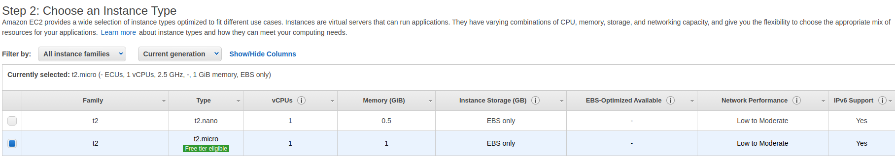

# devops-school-aws

## what should we get?

## how do we do it?

1. Create VPC

2. Create Subnets

3. Create IGW

4. Create Route Table

5. Create Security Groups

6. Work with DB

6.1 Create DB Subnet

6.2 Create DB Instance

7. Create EFS

8. Create EC2 Instances

9. Create Target Group

10. Create Load Balancer

